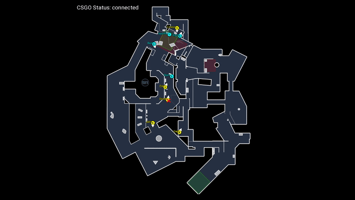

# CSGO External Fullscreen Minimap

**Disclaimer:** This was hacked together in a day by me and is in no way bug-free, and neither is the source code of perfect quality. I will probably work on this in the future but for now this thing works and is enough for our CSGO Production @ [Craptec](https://twitch.tv/craptec_team). 

Only the 7 active duty maps are supported and the overviews have to be imported manually, either by downloading them from [SimpleRadar](http://simpleradar.com/) or copying them from csgo. To use your overviews, you have to convert them from .dds to .png, i can recommend Paint.NET for that. There are probably other programs that can do that, but I did it with it and it works.

Then you have to put the gamestate_integration_minimap.cfg into your personal CSGO cfg folder at `/userdata/x/730/local/cfg` relative to your main Steam installation directory.

If you have placed the cfg file into the folder and the converted overviews into the working directory (where the .exe is) you can use the program. You don't have to launch the program before csgo or otherwise. As long as you are on spectator, data should be going into the program via CSGO's official gamestate API. 

### Have fun observing!