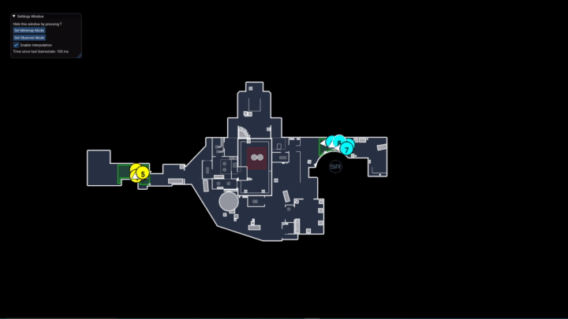

# CSGO External Fullscreen Minimap

**Disclaimer:** This was hacked together in a a few days by me and is in no way bug-free, and neither is the source code of perfect quality. I will probably work on this in the future but for now this thing works and is enough for our CSGO Production @ [CrapTec](https://twitch.tv/craptec_team). 

## Features
- Observer mode (draw two layers side by side, good for observing on Nuke and Vertigo)
- Minimap mode (no names, big player circles and number)
- Both modes configurable in `config.json`
- Interpolation for smooth movement (can also be toggled if the minimap is used over network)
- Transparent clear color for usage as a minimap in the stream

## Setup
1. Import your overviews. The overviews have to be in a format SFML understands, so `.dds` is not supported. I can recommend Paint.Net to convert the `.dds` overviews from CSGO or SimpleRadar to `.png`.
2. Setup your overviews in the config. If you just plan to use the map on the 7 active duty maps you are already good to go since they are already configured in the `config.json`.
3. Import your grenade sprites into the grenades folder. They are called `weapon_decoy.png`, `weapon_flashbang.png`, `weapon_hegrenade.png`, `weapon_incgrenade.png`, `weapon_molotov.png` and `weapon_smokegrenade.png`
4. Import the Gamestate Integration Config into your personal CSGO cfg folder at `/userdata/x/730/local/cfg` relative to your main Steam installation directory.

After that you should be good to go. As long as you have a demo running the minimap should get data from CSGO.

## Future Plans
Here are some features I may implement in the future in no particular order:
- In-Program config editing
- Dynamic Zooming into the bombspots
- Various Bugfixes
- Mac/Linux Builds (This project already works on Mac and probably on Linux too, but I have to find out how to package macOS Apps and Linux packages)

### Have fun observing!